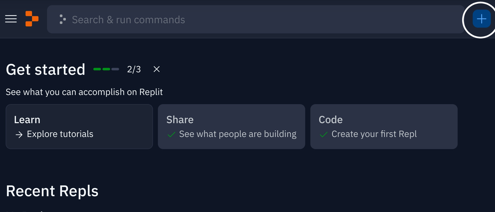
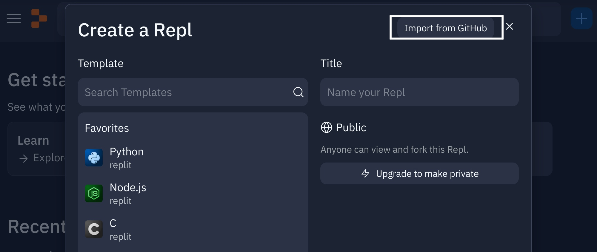
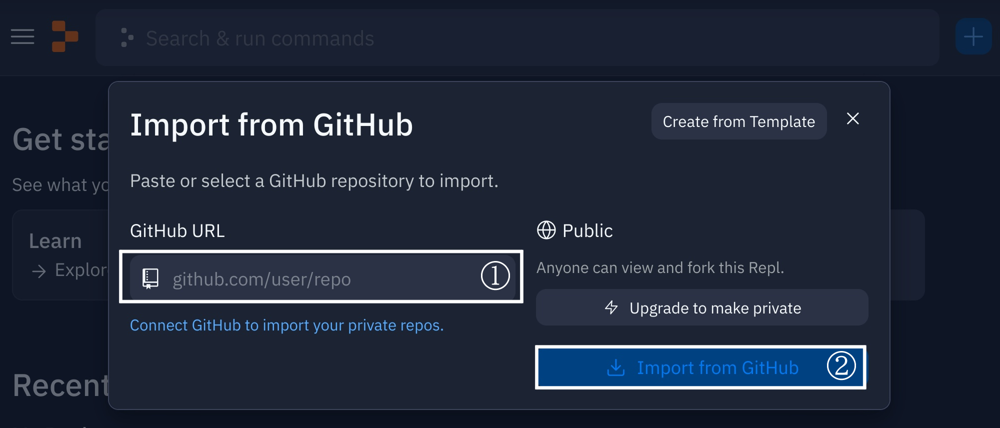

# SBCL 用 Replit テンプレート

このリポジトリは、[Replit.com](https://replit.com/) のサービス内で SBCL の Repl を起動させるためのテンプレートです。

## 使い方

1. [Replit.com](https://replit.com/) のサービスにログインし、 Create a REPL ボタン(`+`) を押します。

2. 次に Import from GitHub 画面に切り替えます。

3. 入力欄にこのリポジトリのURLを書き込み、Import from GitHub ボタンを押します。

### Replit アカウントの作り方

2023年4月現在、 Replit は以下の手段でログインできます。

* メールアドレス認証
* ログイン認証(Google and GitHub)

## ライセンス

このリポジトリは MIT ライセンスにより提供されています。

Copyright :copyright: 2023 Tsuyoshi Matsudate
